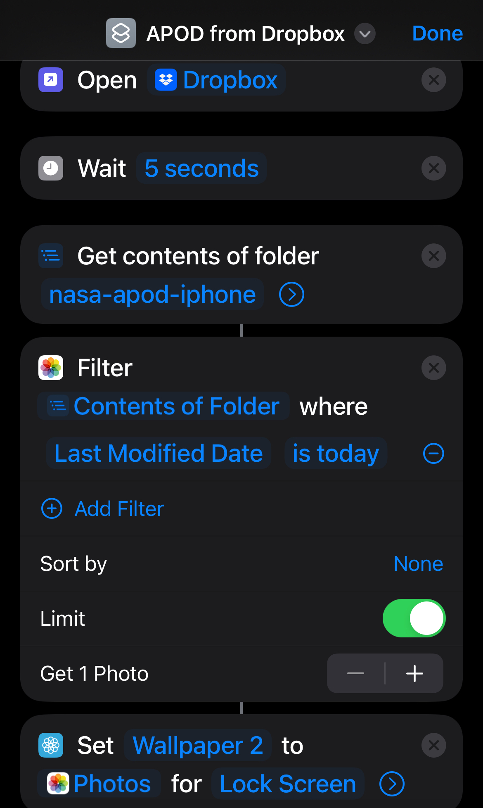
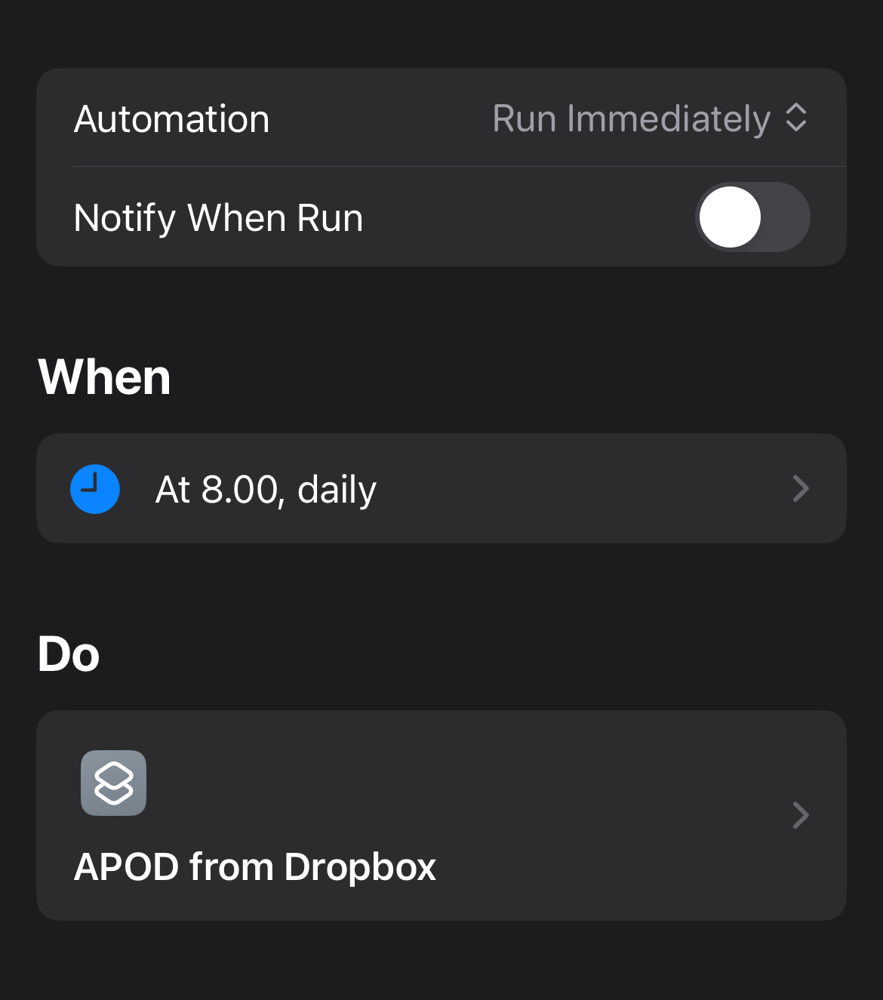

# nasa-pod-wallpaper

Every day, this script:

1. Gets NASA's Astronomy Picture of the Day (APOD) using NASA's API.
2. Uploads it to a specified folder on Dropbox.
3. Sets the image as the wallpaper on the lock screen of my iPhone using Apple Shortcuts.

## Setup Instructions

### Prerequisites
1. Create an account on [NASA API](https://api.nasa.gov/) to get your API key.
2. Create an account on [Dropbox](https://www.dropbox.com/) and generate an app key, app secret, and refresh token.

### Setting up GitHub Actions
1. Fork this repository.
2. Add the following secrets to your GitHub repository settings:
   - `NASA_API_KEY`
   - `DROPBOX_APP_KEY`
   - `DROPBOX_APP_SECRET`
   - `DROPBOX_REFRESH_TOKEN`

### Instructions on how to setup Apple Shortcuts on your iPhone

  
  

1. Create a new shortcut to download the latest picture from your Dropbox.
2. Create another shortcut to set this image as your lock screen wallpaper.
3. Schedule these shortcuts to run every morning.

This setup ensures that every morning, your iPhone lock screen will display NASA's latest Astronomy Picture of the Day, providing a fresh and inspiring start to your day.
