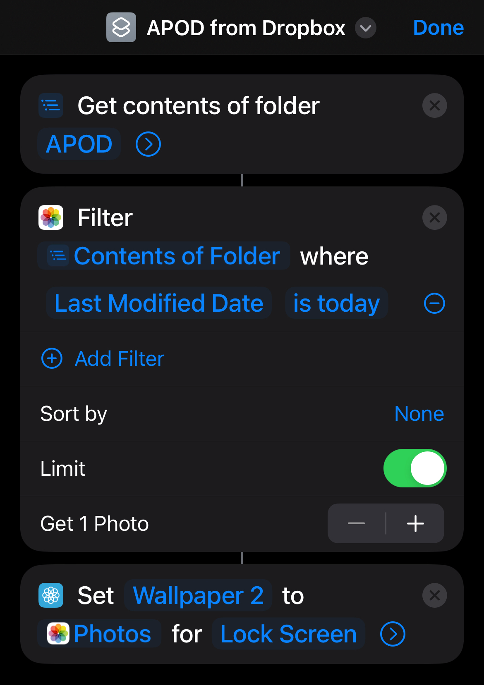
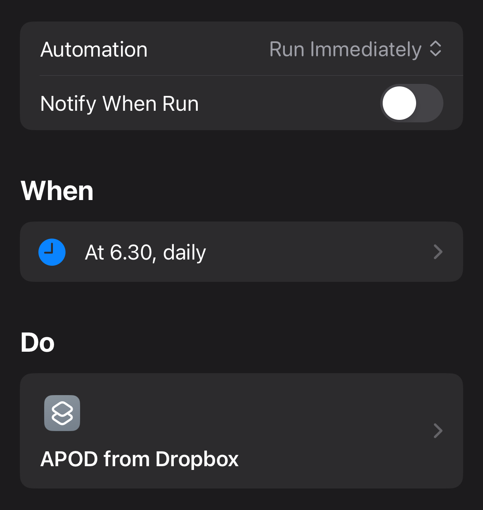

# nasa-pod-wallpaper

Every day, this script:

1. Gets NASA's Astronomy Picture of the Day (APOD) using NASA's API.
2. Uploads it to a specified folder on Dropbox.
3. Sets the image as the wallpaper on the lock screen of my iPhone using Apple Shortcuts.

## Instructions on how to setup Apple Shortcuts on your iPhone

  
  

